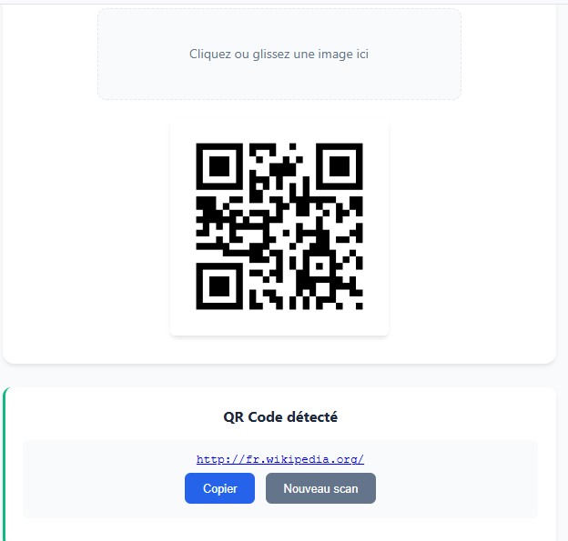

# Qr_Code

## Description
Application web permettant de scanner des QR Codes via la caméra du navigateur ou à partir d’une image importée, et d’afficher instantanément le contenu détecté.  
Ce projet est le **quinzième** du défi personnel **100 projets en 2026**.

---

## Objectifs du projet
- Accéder à la caméra via le navigateur
- Lire et décoder des QR Codes
- Manipuler des fichiers image
- Gérer les permissions utilisateur
- Concevoir une expérience simple et intuitive

---

## Plateforme
- Web (navigateur)

---

## Technologies utilisées
- HTML
- CSS
- JavaScript (Vanilla)
- Librairie JavaScript de lecture de QR Code

---

## Fonctionnalités
- Scan de QR Code via la caméra
- Import d’image contenant un QR Code
- Affichage du contenu détecté
- Bouton pour copier le résultat
- Message d’erreur si aucun QR Code n’est détecté

---

## Design & UX
- Interface claire et épurée
- Zone centrale pour le scan
- Résultat affiché dans une carte distincte
- Feedback visuel lors du scan
- Responsive (mobile et desktop)

---

## Captures d’écran

---

## Ce que j’ai appris
- Accès à la caméra avec JavaScript
- Gestion des permissions navigateur
- Utilisation d’une librairie externe
- Manipulation de fichiers image
- Amélioration de l’UX avec feedback utilisateur

---

## Améliorations possibles
- Historique des scans
- Détection automatique de liens
- Mode sombre
- Générateur de QR Code intégré

---

## Statut du projet
 **Projet terminé**
